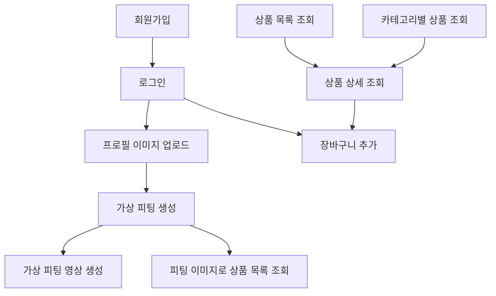

# 백엔드 API 분석 보고서

## 프로젝트 개요

**기술 스택**: Django + Django REST Framework  
**인증 방식**: JWT (Simple JWT) + 쿠키 기반 인증  
**API 문서**: Swagger UI (`/swagger/`)  
**Base URL**: `http://127.0.0.1:8000/api/v1/`

## 전체 API 엔드포인트 목록

### 1. 사용자 관리 (User) - `/api/v1/users/`

| 엔드포인트 | 메서드 | 기능 | 인증 필요 |
|-----------|--------|------|----------|
| `/signup` | POST | 회원가입 | ❌ |
| `/login` | POST | 로그인 | ❌ |
| `/logout` | POST | 로그아웃 | ✅ |
| `/token/refresh` | POST | 토큰 재발급 | ❌ |
| `/cart` | POST | 장바구니 추가 | ✅ |
| `/cart/list` | GET | 장바구니 조회 | ✅ |
| `/cart/<int:cart_product_id>` | PUT/DELETE | 장바구니 수정/삭제 | ✅ |
| `/profile-image` | PATCH | 프로필 이미지 변경 | ✅ |

### 2. 상품 관리 (Product) - `/api/v1/products/`

| 엔드포인트 | 메서드 | 기능 | 인증 필요 |
|-----------|--------|------|----------|
| `/` | POST | 상품 등록 | ❌ |
| `/<int:product_id>/images` | POST | 상품 이미지 업로드 | ❌ |
| `/information/` | GET | 상품 목록 조회 | ❌ |
| `/<int:product_id>` | GET | 상품 상세 조회 | ❌ |

### 3. 카테고리 관리 (Category) - `/api/v1/categories/`

| 엔드포인트 | 메서드 | 기능 | 인증 필요 |
|-----------|--------|------|----------|
| `/` | GET | 카테고리별 상품 조회 | ❌ |

### 4. 가상 피팅 (Fitting) - `/api/v1/fittings/`

| 엔드포인트 | 메서드 | 기능 | 인증 필요 |
|-----------|--------|------|----------|
| `/images` | POST | 가상 피팅 생성 (저품질) | ✅ |
| `/images/edit-bg-white` | POST | 배경 흰색 편집 | ❌ |
| `/images/detail` | POST | 가상 피팅 생성 (고품질) | ✅ |
| `/<int:product_id>/videos` | POST | 가상 피팅 영상 생성 | ✅ |
| `/<int:product_id>/videos/status` | GET | 영상 생성 상태 조회 | ✅ |

## 주요 API 상세 분석

### 1. 인증 관련 API

#### 회원가입 (`POST /api/v1/users/signup`)
```json
// 요청 (multipart/form-data)
{
  "username": "string",
  "email": "string",
  "password": "string",
  "password2": "string",
  "profile_image": "file (optional)"
}

// 응답
{
  "message": "회원가입이 완료되었습니다.",
  "user_id": 1,
  "profile_image_url": "https://s3.amazonaws.com/..."
}
```

#### 로그인 (`POST /api/v1/users/login`)
```json
// 요청
{
  "username": "string",
  "password": "string"
}

// 응답 (쿠키 포함)
{
  "status": 200,
  "access_token": "eyJ0eXAiOiJKV1QiLCJhbGciOiJIUzI1NiJ9...",
  "refresh_token": "eyJ0eXAiOiJKV1QiLCJhbGciOiJIUzI1NiJ9...",
  "message": "로그인 성공"
}
```

### 2. 상품 관련 API

#### 상품 목록 조회 (`GET /api/v1/products/information/`)
```json
// 요청 파라미터
{
  "show_fitting": "true/false" // 피팅 이미지 vs 원본 이미지
}

// 응답
{
  "products": [
    {
      "product_id": 1,
      "name": "상품명",
      "price": 50000,
      "image": "https://s3.amazonaws.com/...",
      "content": "상품 설명"
    }
  ]
}
```

#### 상품 상세 조회 (`GET /api/v1/products/<int:product_id>`)
```json
// 요청 파라미터
{
  "show_fitting": "true/false"
}

// 응답
{
  "product_id": 1,
  "name": "상품명",
  "content": "상품 설명",
  "price": 50000,
  "count": 10,
  "model_image": "https://s3.amazonaws.com/...",
  "product_images": [
    "https://s3.amazonaws.com/image1.jpg",
    "https://s3.amazonaws.com/image2.jpg"
  ]
}
```

### 3. 장바구니 관련 API

#### 장바구니 추가 (`POST /api/v1/users/cart`)
```json
// 요청
{
  "product_id": 1,
  "quantity": 2
}

// 응답
{
  "cart_product_id": 1,
  "product_id": 1,
  "name": "상품명",
  "price": 50000,
  "quantity": 2,
  "image": "https://s3.amazonaws.com/..."
}
```

#### 장바구니 조회 (`GET /api/v1/users/cart/list`)
```json
// 응답
{
  "cart_product": [
    {
      "cart_product_id": 1,
      "product_id": 1,
      "name": "상품명",
      "price": 50000,
      "quantity": 2,
      "image": "https://s3.amazonaws.com/..."
    }
  ],
  "total_price": 100000
}
```

### 4. 가상 피팅 관련 API

#### 가상 피팅 생성 (`POST /api/v1/fittings/images`)
```json
// 응답 (비동기 처리)
{
  "message": "가상 피팅 작업이 병렬로 예약되었습니다.",
  "task_group_id": "string",
  "total_products": 10
}
```

#### 가상 피팅 영상 생성 (`POST /api/v1/fittings/<int:product_id>/videos`)
```json
// 응답
{
  "detail": "영상 생성 요청을 받았습니다. 잠시 후 상태를 확인하세요."
}
```

#### 영상 생성 상태 조회 (`GET /api/v1/fittings/<int:product_id>/videos/status`)
```json
// 응답
{
  "status": "completed", // pending | processing | completed | failed
  "video_url": "https://s3.amazonaws.com/video.mp4"
}
```

## 데이터베이스 모델 구조

### User 모델
- `username`: 사용자명 (unique)
- `email`: 이메일
- `profile_image`: 프로필 이미지 URL
- `is_fitting`: 피팅 작업 상태 (Boolean)

### Product 모델
- `category`: 카테고리 외래키
- `name`: 상품명
- `content`: 상품 설명
- `price`: 가격
- `count`: 재고
- `image`: 대표 이미지 URL

### CartItem 모델
- `user`: 사용자 외래키
- `product`: 상품 외래키
- `quantity`: 수량
- unique_together: (user, product)

### FittingResult 모델
- `user`: 사용자 외래키
- `product`: 상품 외래키
- `status`: 영상 생성 상태 (pending/processing/completed/failed)
- `image`: 피팅 이미지 URL
- `video`: 피팅 영상 URL

## API 의존성 관계



## 프론트엔드 연동 우선순위

### Phase 1: 기본 인증 및 상품 조회
1. **회원가입/로그인** (`/users/signup`, `/users/login`)
2. **상품 목록 조회** (`/products/information/`)
3. **상품 상세 조회** (`/products/<id>`)
4. **카테고리별 상품 조회** (`/categories/`)

### Phase 2: 장바구니 기능
5. **장바구니 추가** (`/users/cart`)
6. **장바구니 조회** (`/users/cart/list`)
7. **장바구니 수정/삭제** (`/users/cart/<id>`)

### Phase 3: 사용자 프로필 관리
8. **프로필 이미지 업로드** (`/users/profile-image`)
9. **토큰 재발급** (`/users/token/refresh`)
10. **로그아웃** (`/users/logout`)

### Phase 4: 가상 피팅 기능
11. **가상 피팅 생성** (`/fittings/images` 또는 `/fittings/images/detail`)
12. **피팅 이미지로 상품 목록 조회** (`/products/information/?show_fitting=true`)
13. **가상 피팅 영상 생성** (`/fittings/<id>/videos`)
14. **영상 생성 상태 조회** (`/fittings/<id>/videos/status`)

## 구현 시 주의사항

### 1. 인증 처리
- JWT 토큰이 쿠키에 저장됨 (`access`, `refresh`)
- axios 인터셉터에서 쿠키 기반 인증 처리 필요
- 토큰 만료 시 자동 갱신 로직 구현

### 2. 파일 업로드
- 회원가입 시 프로필 이미지: `multipart/form-data`
- 프로필 이미지 변경: `multipart/form-data`
- 모든 이미지는 S3에 저장되어 URL로 반환

### 3. 비동기 처리
- 가상 피팅 생성: 비동기 Celery 작업
- 영상 생성: 외부 API 호출 후 폴링 필요
- 실시간 상태 업데이트를 위한 폴링 로직 구현

### 4. 상품 이미지 분기
- `show_fitting` 파라미터로 피팅 이미지 vs 원본 이미지 구분
- 피팅 완료 후 상품 목록에서 피팅 이미지 표시

### 5. 에러 처리
- 표준 HTTP 상태 코드 사용
- 에러 메시지는 `error` 또는 `detail` 필드에 포함
- 404, 400, 401, 500 등 적절한 상태 코드 처리

이 분석을 바탕으로 프론트엔드에서 체계적으로 API를 연동하여 AI 가상 피팅 서비스를 구현할 수 있습니다.